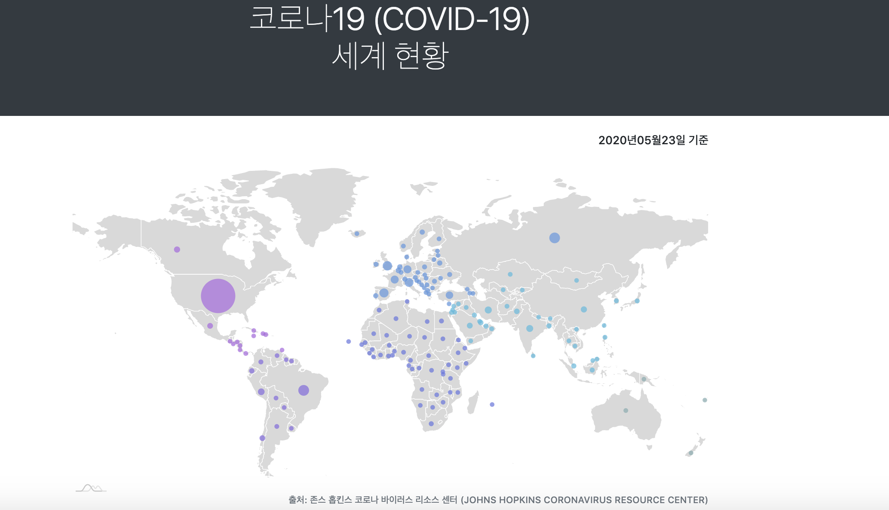
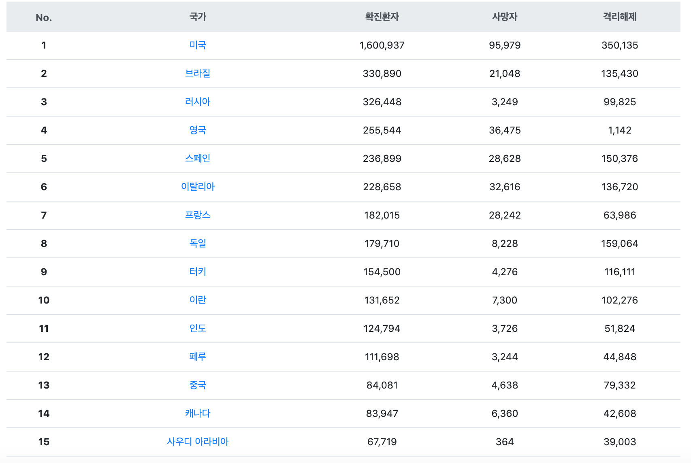
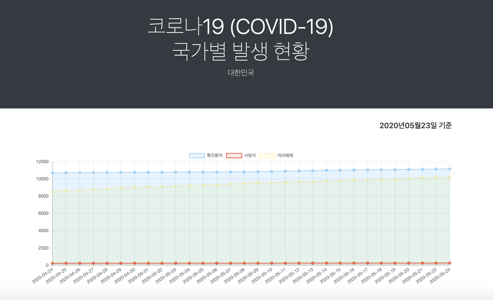
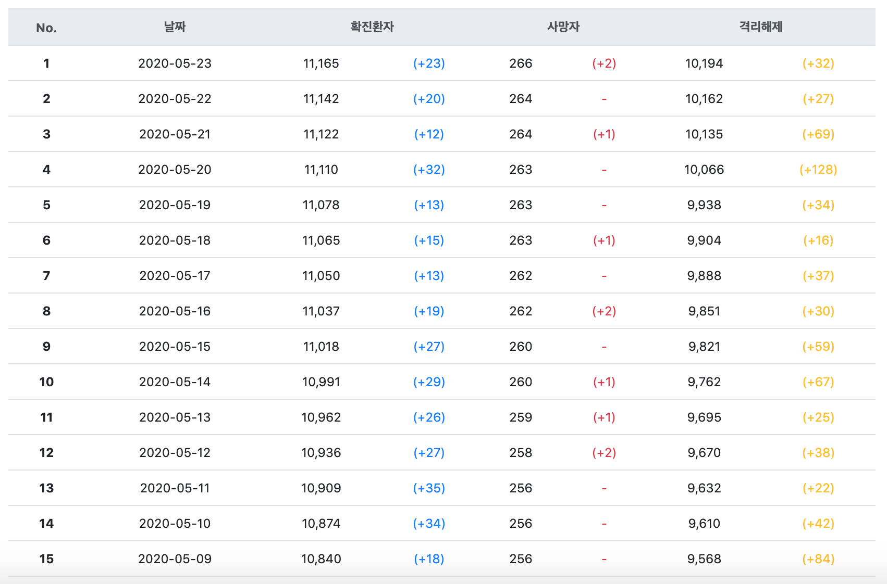

# world-corona-info
코로나19(COVID-19) 세계 감염 현황을 표시하는 사이트입니다.  
국내 뿐만 아니라 해외 감염 현황에 대한 정보를 확인할 수 있는 사이트가 있으면 좋겠다는 생각이 들어 직접 제작해보게 되었습니다.

## 개발환경
프로젝트 개발환경은 다음과 같습니다.
* IDE : Eclipse 
* Git Tools : Source Tree
* OS : Mac OS X
* SpringBoot 2.2.2
* Java8
* Apache Maven

## URL
https://corocoro.world

## 메인화면

* amChart.js에서 제공하는 지도를 사용하였습니다. 
* 지도 상의 동그라미에 마우스를 가져다대면 국가명과 감염자 수가 표시되며, 클릭하면 해당 국가의 상세페이지로 넘어갑니다.
* 리스트에 있는 국가명을 클릭해도 상세페이지로 넘어갑니다.
* 스프링부트 @Scheduled의 cron 기능을 3시간 마다 실행하여 [존스홉킨스 코로나바이러스 Daily Report](https://github.com/CSSEGISandData/COVID-19/tree/master/csse_covid_19_data/csse_covid_19_daily_reports)를 크롤링 하고 있습니다.

## 상세화면

* Chart.js에서 제공하는 꺽은선 그래프를 사용하였습니다.
* 30일간의 감염 추이를 그래프로 표현하여, 한눈에 흐름을 파악할 수 있습니다.
